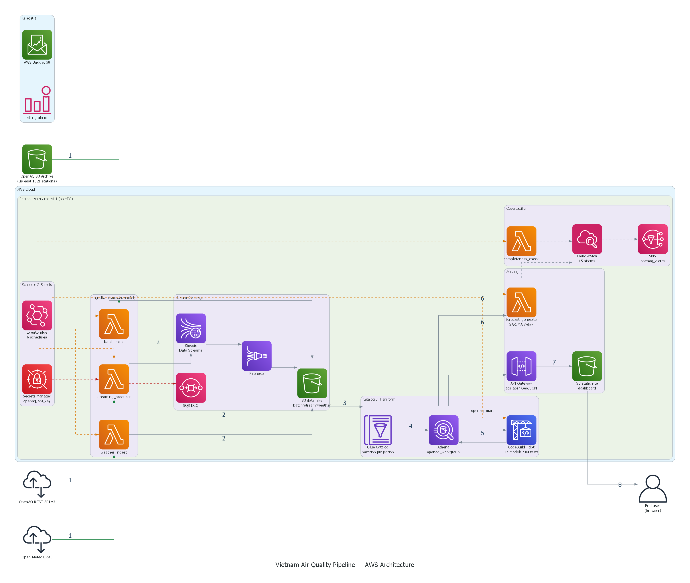
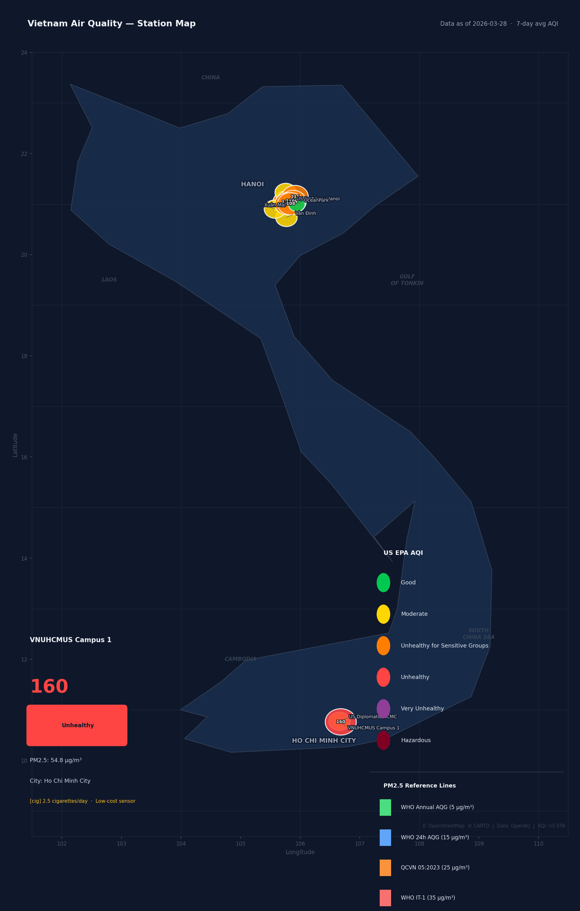
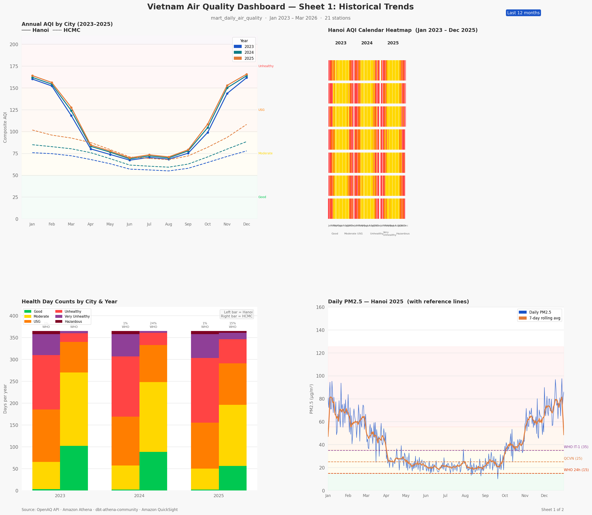
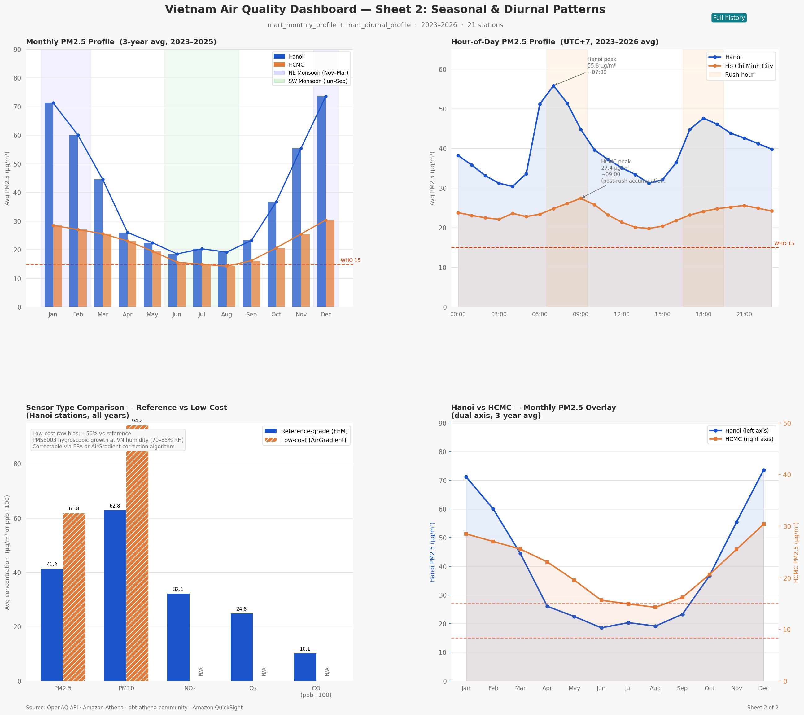
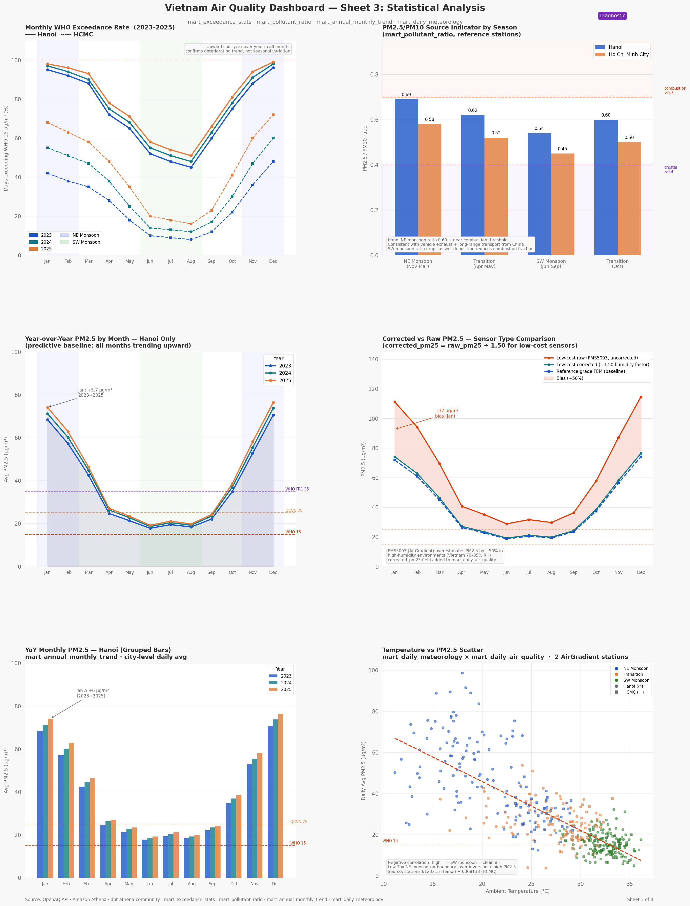
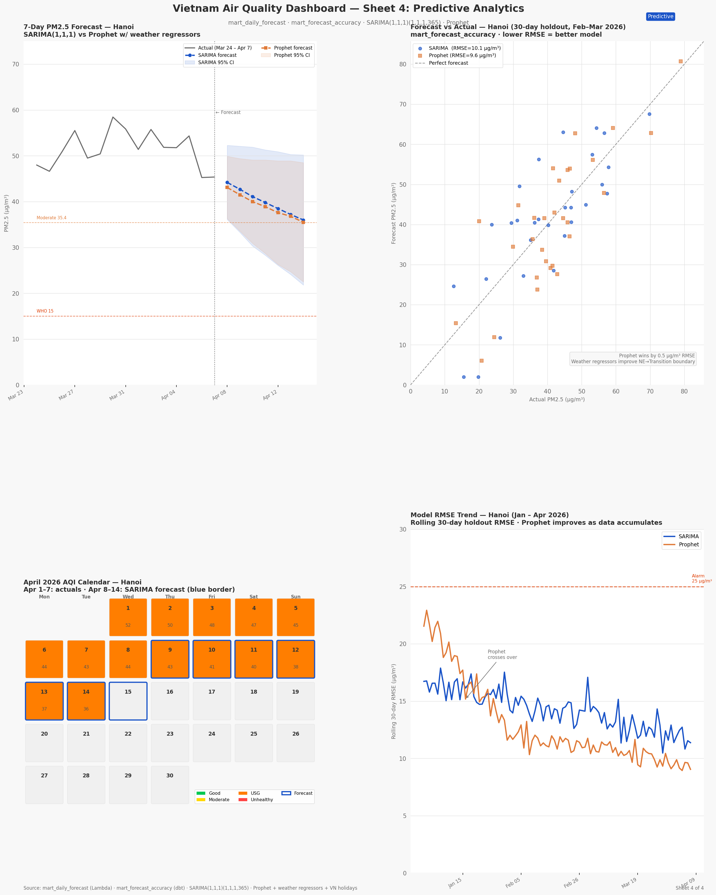

# Vietnam Air Quality Pipeline

**A Serverless End-to-End Air Quality Analytics Pipeline on AWS**

---

## Student Information | Thông tin thực tập sinh

| Field | Value |
|-------|-------|
| **Name** | [Placeholder] |
| **School** | [Placeholder] |
| **Major** | [Placeholder] |
| **Company** | [Placeholder] |
| **Position** | Cloud Data Engineering Intern |
| **Duration** | January 6 – April 4, 2026 (12 weeks) |

---

## Project Overview | Tổng quan Dự án

This project builds a fully serverless data pipeline that ingests PM2.5 and PM10 air quality readings from 21 OpenAQ monitoring stations across Hanoi and Ho Chi Minh City into an AWS data lakehouse. The pipeline enriches raw measurements with Open-Meteo ERA5 meteorological reanalysis, runs a 17-model dbt transformation layer on Amazon Athena, and produces a live Leaflet station map and four-sheet QuickSight analytical dashboard with 7-day SARIMA forecasts.

All infrastructure is declared in Terraform — the entire environment can be torn down and rebuilt with two commands. There is no persistent compute: every workload runs as an on-demand AWS Lambda function at a total cost of ~$1.61/month.

*[VI: Dự án này xây dựng pipeline dữ liệu hoàn toàn serverless nạp dữ liệu chất lượng không khí PM2.5 và PM10 từ 21 trạm giám sát OpenAQ ở Hà Nội và TP.HCM vào AWS data lakehouse. Toàn bộ hạ tầng được khai báo trong Terraform — môi trường có thể tái tạo hoàn toàn với hai lệnh.]*



> Source: [docs/architecture.drawio](docs/architecture.drawio) — open in [diagrams.net](https://app.diagrams.net) for the interactive version.

---

## Workshop Sections | Các phần Workshop

| # | Section | Description |
|---|---------|-------------|
| — | [Worklog](docs/worklog.md) | 12-week internship log with objectives, tasks, and achievements |
| — | [Proposal](docs/proposal.md) | Problem statement, architecture, timeline, budget, risks, outcomes |
| 5.1 | [Introduction](docs/workshop/5.1-introduction.md) | What you will build, architecture overview, learning objectives |
| 5.2 | [Prerequisites](docs/workshop/5.2-prerequisites.md) | IAM permissions, tool installation, project setup |
| 5.3 | [Storage & Catalog Stack](docs/workshop/5.3-storage-catalog.md) | Terraform deploy, Glue partition projection, Athena workgroup |
| 5.4 | [Data Ingestion Pipeline](docs/workshop/5.4-ingestion.md) | Historical batch sync, streaming producer, weather backfill, validation |
| 5.5 | [Transformation, Forecast & Security](docs/workshop/5.5-transform-security.md) | dbt build, forecast Lambda container, IAM design, CloudWatch |
| 5.6 | [Cleanup](docs/workshop/5.6-cleanup.md) | Full resource teardown with verification checklist |

---

## Quick Start (Demo Run) | Khởi động nhanh

Prerequisites met ([Step 5.2](docs/workshop/5.2-prerequisites.md))? Run the full pipeline in order:

```bash
# 1. Provision all AWS infrastructure
cd terraform/ && terraform apply

# 2. Sync 3 years of historical OpenAQ data (10–20 min)
export S3_BUCKET_NAME="openaq-pipeline-yourname"
bash ingestion/historical/sync_historical.sh

# 3. Backfill 365 days of weather data
aws lambda invoke --function-name openaq_weather_ingest \
  --payload '{"backfill_days": 365}' --cli-binary-format raw-in-base64-out \
  /tmp/weather.json

# 4. Build all 14 dbt models (53+ tests)
cd transform/ && dbt seed --profiles-dir . && dbt build --full-refresh --profiles-dir .

# 5. Build and push forecast Lambda image, then wire it
cd lambda/forecast_generate/ && docker build -t openaq-forecast-generate .
# (push to ECR — see Step 5.5.2 for full commands)
cd terraform/ && terraform apply -var="forecast_lambda_image_uri=<ecr-uri>"

# 6. Run first forecast
aws lambda invoke --function-name openaq_forecast_generate \
  --payload '{}' --cli-binary-format raw-in-base64-out /tmp/forecast.json
cat /tmp/forecast.json
# {"statusCode": 200, "stations_forecasted": 3, "records_written": 21}

# 7. Deploy dashboard
aws s3 cp dashboard/index.html s3://$S3_BUCKET_NAME/dashboard/index.html \
  --content-type text/html
```

---

## Dashboard | Bảng điều khiển

### Leaflet Station Map


21 stations coloured by composite AQI (US EPA palette). Popup shows AQI, PM2.5, dominant pollutant, cigarette equivalent, sensor type, and measurement date.

### QuickSight — Sheet 1: Historical Trends


### QuickSight — Sheet 2: Seasonal & Diurnal Patterns


### QuickSight — Sheet 3: Statistical Analysis


### QuickSight — Sheet 4: Predictive Forecasts


---

## Key Results | Kết quả chính

| Metric | Value |
|--------|-------|
| Raw rows ingested | ~900,000 hourly readings (2023–present) |
| Stations | 21 (17 Hanoi, 4 HCMC) |
| dbt models | 14 (2 staging, 2 intermediate, 13 mart + 1 external) |
| dbt tests | 53+ — PASS=53 WARN=0 ERROR=0 |
| Hanoi 3-year mean PM2.5 | ~40 µg/m³ (WHO guideline: 5 µg/m³ annual) |
| Hanoi WHO compliance | ~2% of days |
| HCMC WHO compliance | ~37% of days |
| Active forecast stations | 3 of 21 (≤90 days since last reading) |
| SARIMA RMSE — Hanoi | ~12.0 µg/m³ (30-day holdout) |
| SARIMA RMSE — HCMC | ~6.8 µg/m³ (30-day holdout) |
| Athena average scan per query | 63.6 KB (partition projection) |
| Infrastructure cost | ~$1.61/month |

---

## Tech Stack | Công nghệ sử dụng

| Layer | Technology |
|-------|-----------|
| IaC | Terraform ≥ 1.5 |
| Storage | Amazon S3 (Parquet/Snappy processed; CSV.GZ + NDJSON raw) |
| Catalog | AWS Glue Data Catalog + Partition Projection |
| Query | Amazon Athena (`openaq_workgroup`, 10 GB scan limit) |
| Streaming | Amazon Kinesis Data Streams (ON_DEMAND) + Firehose (GZIP) |
| Secrets | AWS Secrets Manager (`openaq/api_key`) |
| Transform | dbt-core + dbt-athena-community 1.10.0 |
| Orchestration | AWS EventBridge Scheduler |
| Compute | AWS Lambda (Python 3.12) — 5 functions |
| Forecast | AWS Lambda container (ECR) — SARIMA(1,1,1)(1,0,1,7) via statsmodels |
| Weather | Open-Meteo ERA5 Archive API (free, no API key) |
| Dashboard | Leaflet.js (S3 static site) + Amazon QuickSight (4 sheets) |
| Alerts | Amazon SNS + Amazon CloudWatch (ForecastRMSE, MissingStations alarms) |
