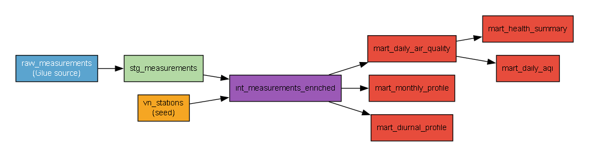

# Vietnam Air Quality Pipeline

## Problem Statement

Air quality across Vietnamese cities has been deteriorating, yet long-term trends and seasonal patterns remain poorly understood by the public and policymakers. This project addresses the analytical question: how has air quality in major Vietnamese cities changed over the past three years, and which pollutants (PM2.5, PM10, NO₂, O₃, CO) and seasons pose the greatest health risk to residents?

The pipeline ingests historical and near-real-time air quality data from the OpenAQ API into Amazon S3, catalogs it via AWS Glue with partition projection, and makes it queryable through Amazon Athena. A dbt transformation layer (dbt-athena-community) produces five mart tables covering daily averages, composite AQI, health summaries, diurnal profiles, and monthly seasonality. A Leaflet map dashboard (S3 static website) surfaces station-level AQI in near-real time via a Lambda API. Infrastructure is fully provisioned as code with Terraform.

## Architecture


### Data Flow

```
OpenAQ S3 Archive ──aws s3 sync──► S3 raw/batch/       ─┐
                                                          ├─► Glue Catalog (openaq_raw)
OpenAQ API v3 ──Lambda──► Kinesis ──Firehose──► S3 raw/stream/ ─┘
                                                          │
                                          Athena (openaq_workgroup)
                                                          │
                                          dbt (dbt-athena-community)
                                                          │
                                     S3 processed/ (openaq_mart schema)
                                                          │
                              Lambda AQI API ◄── mart_daily_aqi
                                     │
                              Leaflet map dashboard (S3 static website)
```

### Two-Source Design

| Dimension | Batch (S3 archive) | Streaming (Kinesis) |
|-----------|-------------------|---------------------|
| Latency | T+1 day (daily sync) | ~30 minutes |
| Coverage | Full history (2023–present) | Rolling 60 days |
| Format | CSV.GZ (OpenAQ partitioned) | NDJSON.GZ (Firehose) |
| Cost | ~$0.02/GB cross-region egress | Lambda + Kinesis + Firehose |
| Purpose | Trend analysis, seasonality | Near-real-time dashboard |

Historical data drives dbt mart tables; streaming data feeds the live map dashboard via the AQI API Lambda.

## Dataset

- **Source:** [OpenAQ](https://openaq.org/) — open air quality data platform
- **Stations:** 21 reference-grade and low-cost sensors across Hanoi and Ho Chi Minh City
- **Parameters:** PM2.5, PM10, NO₂, O₃, CO, SO₂, BC, temperature, relative humidity
- **Coverage:** January 2023 – present (~14,000 daily aggregates per dbt run)
- **Raw row count:** ~900,000 hourly readings in `openaq_raw.raw_measurements`
- **Station list:** [`transform/seeds/vn_stations.csv`](transform/seeds/vn_stations.csv) (21 stations, city/province/lat/lon)

## Tech Stack

| Layer | Technology |
|-------|-----------|
| IaC | Terraform ≥ 1.5, AWS provider ~5.0 |
| Storage | Amazon S3 (Parquet/Snappy in `processed/`, CSV.GZ in `raw/`) |
| Catalog | AWS Glue Data Catalog + Partition Projection |
| Query | Amazon Athena (openaq_workgroup, 10 GB scan limit) |
| Streaming | Amazon Kinesis Data Streams (ON_DEMAND) + Firehose (GZIP) |
| Transform | dbt-core 1.11.7 + dbt-athena-community 1.10.0 |
| Orchestration | AWS EventBridge Scheduler (daily batch, 30-min streaming) |
| Compute | AWS Lambda (Python 3.12) — batch sync, streaming producer, AQI API |
| Dashboard | Leaflet.js map (S3 static website) + Lambda Function URL API |
| Alerts | Amazon SNS → email (Kinesis iterator age, monthly billing) |

## Warehouse Optimisation

Five optimisations were applied to reduce Athena scan cost:

1. **Parquet + Snappy compression** — all mart tables materialised as Parquet/Snappy (vs. CSV default); reduces scan size ~5–10×
2. **Partition by `measurement_date`** — date-filtered dashboard queries scan only matching day-folders; **−91.7% scan** vs. full table for a typical 90-day window
3. **`s3_data_dir` to `processed/`** — mart tables land in a dedicated prefix separate from ephemeral Athena query results; prevents accidental 7-day expiry
4. **Kinesis ON_DEMAND + 7-day retention** — auto-scales to traffic, 7-day replay window for reprocessing
5. **Firehose GZIP** — stream NDJSON compressed ~70% before S3 write; 60-day lifecycle on `raw/stream/`

Proof query scan sizes (see [`docs/metrics.md`](docs/metrics.md)):

| Query | Data scanned |
|-------|-------------|
| `COUNT(*)` full table | **0 bytes** (Parquet footer) |
| `WHERE measurement_date >= '2025-01-01'` | **63.6 KB** |
| `+ location_id + parameter filter` | **102.4 KB** |

## dbt Lineage



| Model | Grain | Rows |
|-------|-------|------|
| `stg_measurements` | raw hourly reading | ~885K (view) |
| `int_measurements_enriched` | reading + station metadata | ~774K |
| `mart_daily_air_quality` | date × station × parameter | ~14,600 |
| `mart_daily_aqi` | date × station | ~7,000 |
| `mart_health_summary` | city × year | 7 |
| `mart_diurnal_profile` | station × parameter × hour | ~1,800 |
| `mart_monthly_profile` | station × parameter × month | ~500 |

## Dashboard

A Leaflet map served from S3 (`dashboard/index.html`) shows each station as a circle marker coloured by current AQI category. Clicking a marker shows PM2.5 (µg/m³) and cigarette-equivalent exposure (Berkeley Earth standard: PM2.5 / 22 µg/m³/day).

**Live URL:** `http://openaq-pipeline-thanhtrung102.s3-website-ap-southeast-1.amazonaws.com/dashboard/index.html`

**API endpoint:** `https://7fv6swyuo5.execute-api.ap-southeast-1.amazonaws.com/` — returns GeoJSON of the 7-day average AQI per station (cached 1h in `/tmp`).

## Reproduction Steps

### Prerequisites

- AWS account with `terraform-admin` IAM user credentials configured (`aws configure`)
- Terraform ≥ 1.5 (`terraform version`)
- Python 3.11+ with `pip`
- Git + Bash (Git Bash on Windows)

### 1. Infrastructure

```bash
cd terraform/
terraform init
terraform apply          # provisions S3, Glue, Athena, Kinesis, Lambda, EventBridge
```

### 2. Build Lambda ZIPs

```bash
bash lambda/build.sh     # outputs lambda/batch_sync.zip, streaming.zip, aqi_api.zip
cd terraform/ && terraform apply   # uploads new zips
```

### 3. Historical Batch Sync

```bash
# Set up Python venv
python -m venv .venv && source .venv/bin/activate   # or .venv\Scripts\activate on Windows
pip install -r requirements.txt

# Sync OpenAQ archive for all 21 Vietnamese stations (2023–present)
bash ingestion/historical/sync_historical.sh
```

### 4. dbt Transform

```bash
cd transform/
pip install dbt-athena-community==1.10.0

# Configure AWS credentials (profiles.yml uses env vars)
export AWS_ACCESS_KEY_ID=...
export AWS_SECRET_ACCESS_KEY=...
export AWS_DEFAULT_REGION=ap-southeast-1

# Install dbt packages
dbt deps

# Run full build (seed + staging + intermediate + marts + tests)
PYTHONUTF8=1 dbt build --full-refresh --profiles-dir .
```

Expected: PASS=53, WARN=0, ERROR=0

### 5. Deploy Dashboard

```bash
aws s3 cp dashboard/index.html s3://openaq-pipeline-thanhtrung102/dashboard/index.html \
  --content-type text/html
```

### Ongoing Operation

EventBridge Scheduler runs automatically:
- **Daily at 02:00 UTC** — batch sync Lambda syncs the previous day's CSV.GZ files
- **Every 30 minutes** — streaming producer Lambda polls OpenAQ API and writes to Kinesis

Run dbt incrementally after batch sync:
```bash
PYTHONUTF8=1 dbt build --profiles-dir .   # incremental (no --full-refresh)
```

## Architecture Decisions

See [`docs/architecture-decision-record.md`](docs/architecture-decision-record.md) for full ADRs covering:
- ADR-001: AWS over GCP (S3 archive co-location)
- ADR-002: S3 sync over API for batch ingestion
- ADR-003: Athena + Glue over Redshift
- ADR-004: dbt-athena-community for transformation
- ADR-005: Kinesis + Firehose over direct S3 write

## Key Metrics

| Metric | Value |
|--------|-------|
| Stations | 21 (16 Hanoi, 5 HCMC) |
| Raw rows | ~900,000 hourly readings |
| Date range | 2023-01-01 – present |
| Hanoi 3-year avg PM2.5 | 40.2 µg/m³ (WHO 24h limit: 15 µg/m³) |
| HCMC 3-year avg PM2.5 | ~85 µg/m³ |
| Hanoi WHO compliance | ~2% of days |
| HCMC WHO compliance | ~37% of days |
| Athena workgroup scan limit | 10 GB/query |
| Full mart rebuild time | ~10 minutes |
