+++
title = "Proposal"
weight = 2
chapter = false
pre = " <b> 2. </b> "
+++

# Proposal

## 2.1 Business problem

Vietnam — especially Hanoi — has some of the highest PM2.5 levels in Southeast Asia, regularly exceeding
the WHO 24-hour guideline (15 µg/m³) and the national QCVN 05:2023 standard. Public air-quality data for
Vietnamese stations exists (OpenAQ), but it is raw, station-level, and not analysis-ready: there is no
consolidated, health-oriented view that combines pollutant readings with meteorology, applies the current
US EPA AQI methodology, tracks compliance over time, or forecasts the coming week.

This project is an **AWS First Cloud Journey (FCJ) portfolio/demonstration**. Its objective is dual:

1. **Demonstrate serverless data-engineering competency** on AWS (the FCJ review goal); and
2. Use a **real, meaningful narrative** — Vietnamese PM2.5 analytics — as the vehicle.

It is a demonstration, not a funded public service: there is no real-user SLA and no regulatory consumer.
The scope is bounded to the 21 OpenAQ stations in the roster.

## 2.2 Objectives

- Ingest historical **and** near-real-time air-quality data for 21 VN stations, plus ERA5 weather covariates.
- Transform it into analysis-ready, tested marts using the current **US EPA 2024 AQI** breakpoints.
- Serve a **live station map** and an **analytics dashboard** (health scorecard, seasonal/weather drivers,
  WHO/QCVN compliance, and a **7-day PM2.5 forecast**).
- Keep everything **serverless, reproducible (Terraform), and inside a ~$3–8/month envelope**.

## 2.3 Target architecture

Three parallel ingestion paths converge on an S3 data lake, are cataloged by Glue (partition projection),
transformed by **dbt-on-Athena** (run by CodeBuild), and served through an API + static dashboard, with a
container-Lambda SARIMA forecaster. *(Diagram facts audited against live state 2026-06-01; the AWS-icon
version is generated from `docs/architecture.yaml` via awslabs diagram-as-code.)*

```mermaid
flowchart LR
  subgraph EXT[External sources]
    A1[OpenAQ S3 Archive]:::ext
    A2[OpenAQ REST API v3]:::ext
    A3[Open-Meteo ERA5]:::ext
  end

  subgraph AWS[AWS Cloud · ap-southeast-1 · no VPC]
    EB[EventBridge Scheduler<br/>6 schedules]:::sched
    SM[Secrets Manager<br/>openaq/api_key]:::sched

    L1[batch_sync<br/>Lambda]:::lam
    L2[streaming_producer<br/>Lambda]:::lam
    L3[weather_ingest<br/>Lambda]:::lam

    KIN[Kinesis + Firehose]:::strm
    S3[(S3 data lake<br/>batch · stream · weather)]:::stor
    GL[Glue Data Catalog<br/>partition projection]:::glue
    ATH[Athena<br/>openaq_workgroup]:::ath
    CB[CodeBuild · dbt<br/>17 models · 84 tests]:::cb

    API[aqi_api + API Gateway<br/>GeoJSON]:::api
    FC[forecast_generate<br/>SARIMA 7-day]:::lam
    DASH[(S3 static site<br/>map + analytics)]:::stor
    CK[completeness_check]:::lam
    CW[CloudWatch · 14 alarms<br/>+ AWS Budget]:::mon
  end
  USER([End user · browser]):::ext

  A1 --> L1
  A2 --> L2
  A3 --> L3
  EB -.-> L1 & L2 & L3 & CB & FC & CK
  SM -.-> L2
  L1 --> S3
  L3 --> S3
  L2 --> KIN --> S3
  S3 --> GL --> ATH
  ATH <--> CB
  ATH --> API
  ATH --> FC
  API --> DASH --> USER
  FC --> CW
  CK --> CW

  classDef ext fill:#e8edf3,stroke:#566,stroke-width:1px,color:#16191f;
  classDef lam fill:#FF9900,stroke:#cc7a00,color:#16191f;
  classDef stor fill:#3F8624,stroke:#2d6019,color:#fff;
  classDef strm fill:#8C4FFF,stroke:#6b3fcc,color:#fff;
  classDef glue fill:#8C4FFF,stroke:#6b3fcc,color:#fff;
  classDef ath fill:#146EB4,stroke:#0f5288,color:#fff;
  classDef cb fill:#146EB4,stroke:#0f5288,color:#fff;
  classDef api fill:#E7157B,stroke:#b51060,color:#fff;
  classDef sched fill:#FF4F8B,stroke:#cc3f6f,color:#fff;
  classDef mon fill:#E7157B,stroke:#b51060,color:#fff;
```

## 2.4 AWS services used

| Layer | Service | Role |
|---|---|---|
| Orchestration | **EventBridge Scheduler** | 6 schedules drive every job (scale-to-zero, no servers) |
| Ingestion | **Lambda** (×3, arm64) | batch_sync, streaming_producer, weather_ingest |
| Streaming | **Kinesis Data Streams + Firehose** | near-real-time API → S3 (`raw/stream/`) |
| Storage | **S3** | raw lake, processed marts, static website; lifecycle + Intelligent-Tiering |
| Catalog | **Glue Data Catalog** | partition projection (no crawler) |
| Query/Transform | **Athena + dbt** (CodeBuild) | 17 dbt models, EPA-2024 AQI, 84 tests |
| Serving | **API Gateway + Lambda** | GeoJSON map + `/analytics/*` JSON |
| ML | **Lambda (ECR container)** | SARIMA 7-day PM2.5 forecast |
| Secrets | **Secrets Manager** | OpenAQ API key (no plaintext) |
| Reliability | **SQS** DLQs | streaming + batch dead-letter |
| Observability | **CloudWatch + SNS** | 14 alarms; **AWS Budget** ($8) |
| State | **S3 remote backend** | versioned + SSE, native lockfile (no DynamoDB) |

## 2.5 Data source

- **OpenAQ** — historical S3 archive (CSV.GZ, `us-east-1`) + REST API v3, 21 VN stations (17 Hanoi-area,
  4 HCMC). Sentinel `-999` filtered; PM2.5 capped at 500 µg/m³ in staging.
- **Open-Meteo ERA5** reanalysis — daily weather covariates (temperature, RH, wind, precipitation, PBL height).

## 2.6 Cost & region

- **Region:** `ap-southeast-1` (Singapore). **Cost:** ≈ **$3.22/month** (estimate) — guarded by a 10 GB
  Athena scan cap, scale-to-zero serverless, storage tiering, and an AWS Budget at $8.

## 2.7 Success criteria

1. End-to-end pipeline live: ingest → catalog → marts → API → dashboard, current data.
2. Correct EPA-2024 AQI (machine-verified by dbt **unit tests**).
3. 7-day SARIMA forecast live with RMSE monitoring.
4. Fully reproducible from `terraform apply` (verified from a fresh clone).
5. Well-Architected: no open high risks; within the cost envelope.

All five are met and verified live (see [Workshop]({}) for the reproducible build).

## 2.8 Reproducibility & project record

The build is reproducible end-to-end (Terraform + a bilingual workshop runbook) and the engineering
process is captured in the repository:

- **Architecture & design:** `docs/PIPELINE-REPORT.md`, `docs/architecture.yaml` (AWS-icon diagram source).
- **Data flow & governance:** `docs/DATA-LIFECYCLE.md`; **test strategy:** `docs/DATA-QUALITY.md`.
- **Well-Architected review:** `docs/WELL-ARCHITECTED.md`; **deployed inventory:** `docs/DEPLOYED-SPECS-AND-AUDIT.md`.
- **Progress record:** `process/features/fcj-portfolio-hardening/` (umbrella plan, phase decisions, sprint
  reports) and `process/general-plans/completed/`.
